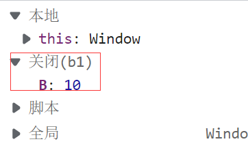

# 作用域

## 局部作用域

+ 分为函数作用域和块作用域
+ 函数作用域
  + 函数的参数也是函数内部的变量
  + 函数执行完后,内部变量被被清空
  + 内部声明,外部无法使用
  + 函数拿不到其他函数的数据
+ 块作用域
  + 只要带了{}的都是块作用域,for循环,对象,函数也是一种
  + 内部声明的数据 let 或者const会产生作用域，产生一个暂时性死区,但是var不会产生,所以var声明的外部可以访问到
  + 所以少用var
  + 块拿不到其他块的数据


## 全局作用域

+ 放在.js文件或者script标签内部的
+ 为window添加属性默认是全局的
+ 没有关键字声明的也是全局的
+ 少用全局避免全局污染


## let和var

[let 和 const 命令 - ECMAScript 6入门 (ruanyifeng.com)](https://es6.ruanyifeng.com/#docs/let)

+ 不存在变量提升
+ 在块级作用域使用时
  + 暂时性死区（不受外界影响）
    + 出现：当我们使用了let和const在块级作用域中，那么这个作用域就会变成一个封闭的空间，如果提前在声明之前使用变量就会报错

## 作用域链

作用：变量查找机制

+ 会从小到大查找
+ 子能找到父，父不能找子


## 垃圾回收机制

### 什么是垃圾回收机制

gc，当声明的变量函数，调用结束后会被垃圾回收器 回收

### 内存的生命周期

+ 内存分配
  + 声明变量，函数
+ 内存使用
  + 读写内存，调用函数变量
+ 内存回收
  + 调用完毕后，回收内存
+ 注意：
  + 全局变量不会被回收
  + 一般情况下，局部变量不使用了就会被回收


## 闭包

### 什么是闭包？

闭包=内层函数+外层函数变量

### 作用

封闭数据，让外部可以访问到函数内部的变量

常用写法:

```javascript
// 第一种格式
    // function b1 () {
    //   let B = 10
    //   function b2 () {
    //     console.log(B)
    //   }
    //   return b2
    // }

    // b1()()

    // 第二种
    // function b1 () {
    //   let B = 10
    //   return function () {
    //     console.log(B);
    //   }
    // }
    // b1()()

    // 第三种
    function b1 () {
      let B = 10
      return function () {
        return B
      }
    }
    let zhi = b1()()
    console.log(zhi);
```

调试时也能看见作用域里的closure作用域




### 闭包可能产生的问题

内存泄漏

```javascript
    // 应用：计算函数调用次数，实现数据的私有
    function fn () {
      let i = 0
      return function () {
        console.log(++i);
      }
    }

    let count = fn()
    count()
    count()
    count()
 
```

+ 如上面代码，count=fn（）为全局变量，所以只有当关闭页面才会回收它
+ 而fn（）又使用了里面的匿名函数
+ 匿名函数又使用了外部函数的i，所以i这个变量不会被回收
+ 所以就造成了内存的泄露


## 变量提升

+ var会把声明提前到 **作用域** 的最前面
+ 只声明提前，不会赋值提前
+ let和canst不会
